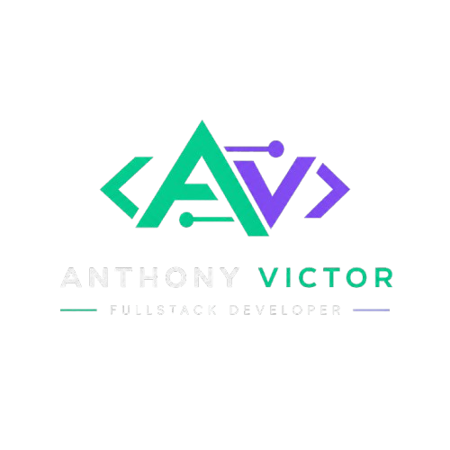
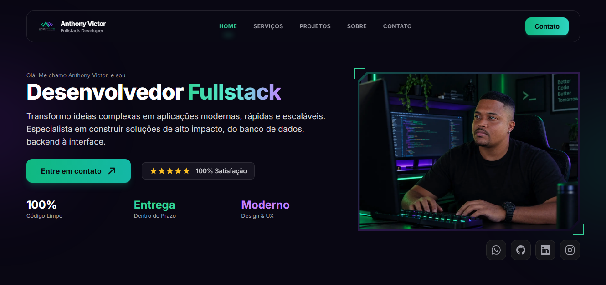

<div align="center">
  <a href="https://thonnyvictor.vercel.app/" target="_blank">
    
  </a>

  <h1 align="center">Anthony Victor — Full-Stack Developer Portfolio</h1>

  <p align="center">
    Plataforma web de alta performance desenvolvida para apresentar serviços, projetos de software, stack técnica e canais de contato.
  </p>

  <p align="center">
    <a href="https://thonnyvictor.vercel.app/" target="_blank">
      
    </a>
  </p>

  <p align="center">
    
    
    
    
    
  </p>

  <br />

  <a href="https://thonnyvictor.vercel.app/" target="_blank">
    
  </a>
</div>

<br />

---

## 💻 Sobre o Projeto

Esta é a minha landing page e portfólio pessoal. Desenvolvida com foco em performance, responsividade e experiência do usuário (UX), a aplicação apresenta uma arquitetura limpa, navegação fluida por seções ativas (Intersection Observer) e suporte a layouts móveis otimizados.

### ✨ Principais Recursos
- 🚀 **Performance Extrema:** Construído sobre o ecossistema Next.js Server-Side Rendering (SSR) e otimização de ativos.
- 🎨 **Design System Moderno:** Interface escura (*Dark Mode*) personalizada em Tailwind CSS com componentes reutilizáveis.
- 📱 **100% Responsivo:** Adaptado dinamicamente para dispositivos móveis, tablets e desktops.
- 🔍 **Navegação Inteligente:** Controle de estado da rota visível através de escuta adaptativa do scroll.

---

## 🛠️ Stacks e Tecnologias

A aplicação utiliza as seguintes tecnologias no ecossistema moderno de desenvolvimento web:

- **Core:** [Next.js](https://nextjs.org/), [React](https://react.dev/), [TypeScript](https://www.typescriptlang.org/)
- **Estilização:** [Tailwind CSS](https://tailwindcss.com/)
- **Ícones & Efeitos:** [React Icons](https://react-icons.github.io/react-icons/), [Tailwind Animate](https://github.com/jamiebuilds/tailwindcss-animate)
- **Notificações & Formulários:** [React Toastify](https://fkhadra.github.io/react-toastify/introduction), [EmailJs](https://www.emailjs.com/), [Zod](https://zod.dev/)

---

## 🚀 Como Rodar Localmente

Certifique-se de ter o **Node.js** (v18 ou superior) e o **Yarn** instalados em seu ambiente.

```bash
# 1. Clone o repositório
git clone https://github.com/anthonyvictor/thonnyvictor.git

# 2. Entre no diretório do projeto
cd thonnyvictor

# 3. Instale as dependências
yarn install

# 4. Inicie o servidor de desenvolvimento
yarn dev
```

Abra [http://localhost:3000](http://localhost:3000) no seu navegador para visualizar a aplicação.

---

## 📬 Contato

Gostou do projeto ou deseja conversar sobre novos desenvolvimentos e consultorias?

- **Website:** [thonnyvictor.vercel.app](https://thonnyvictor.vercel.app/)
- **LinkedIn:** [linkedin.com/in/thonnyvrc](https://www.linkedin.com/in/thonnyvrc/)
- **GitHub:** [@anthonyvictor](https://github.com/anthonyvictor)

<div align="center">
  <sub>Desenvolvido com 💚 por <b>Anthony Victor</b></sub>
</div>